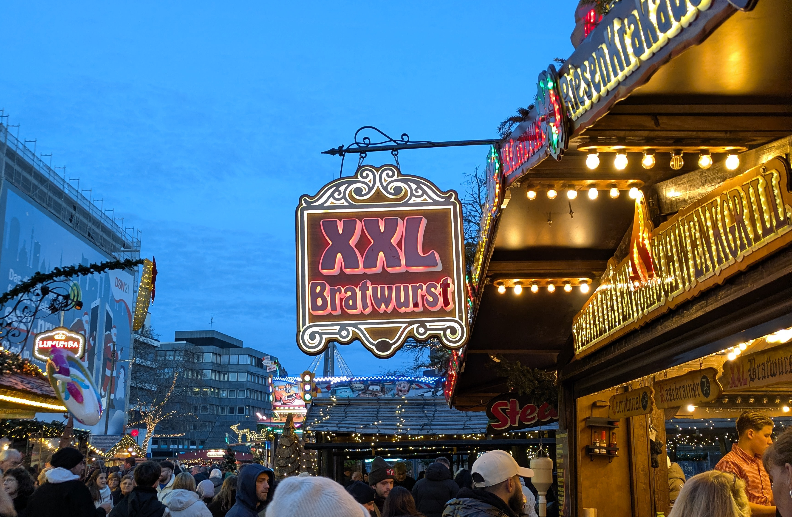

---js
const title = "Weihnachtsmärkte";
const date = "2025-12-24";
const draft = false;
---

## Weihnachtsmärkte, by quality

1. Kassel 
2. Aachen (TIE) 
2. Goslar (TIE) 
4. Dortmund 
5. Köln 
6. Schloss Charlottenburg 
7. Potsdamer Platz  

## Weihnachtsmärkte, by effectiveness in evoking the US Midwest

1. Dortmund

     

## Weihnachtsmärkte, by effectiveness in evoking stampede concerns

1. Köln

